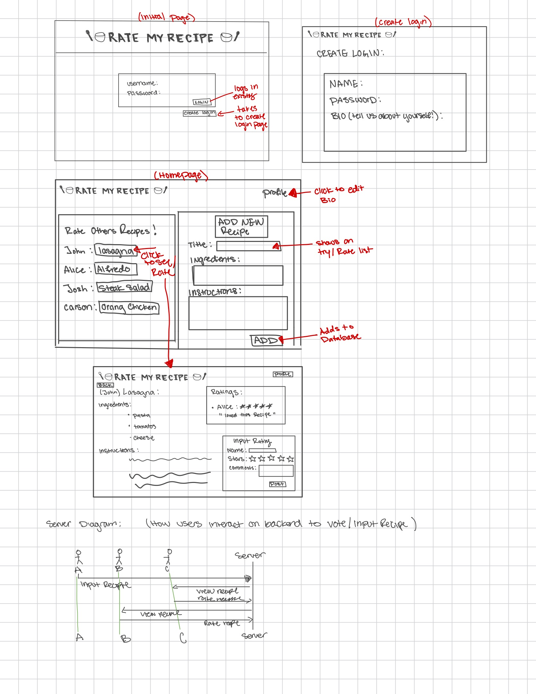

# Rate My Recipe

## Elevator Pitch

Whenever I am searching for a dinner recipe I come across thousands on the internet, sometimes when I make these recipes I feel like they were never worth my time! Rate My Recipe makes it easier to find recipes that you'll actually enjoy. Through this website users will be able to input recipes for others to try, and view existing recipes other useres input. Users can rate recipes they try and view other ratings to determine if they should try it out!

## Design
Below is a rough sketch for the concept design of the website.

## Key Features

- Secure login over HTTPS
- Ability to input your own recipes
- Ability to rate/comment/view other's recipes
- Ability to scroll and view all recipes in database.

## Technologies

I am going to use the required technologies in the following ways.

- **HTML** - Uses correct HTML structure for application. There will be 4 HTML pages for login, create login, homepage, veiwing/rating recipes. Hyperlinks that lead to each page
- **CSS** - Application styling that looks good on different screen sizes, uses good whitespace, color choice and contrast. 
- **JavaScript** - Provides login, choice display, applying reviews, displaying other users recipes and reveiws. 
- **React** - Provides login, option to create recipes, opeion to view others inputs and rate them.
- **Service** - Backend service with endpoints for:
    - login
    - Submitting recipes
    - retrieving ratings
    - retrieving recipes
- **DB/Login** - Stores useres, recipes, and ratings. Register and login users. Profiles and credintials stored in database.
- **WebSocket** - As users input the recipes they are broadcasted to other users.

## HTML Deliverable
For thus deliverable I built a rough structure of my application using HTML

[ ] HTML pages - I created 6 pages
- index / login
- homepage, named it directory.html
- create user 
- update user information
- rating page
- database where all the recipes will go
[ ] Links - In each of the pages contain various links to the other html pages
[ ] Test - there are text boxes for bio's, comments, names, ingredients, and instructions
[ ] Images - I did not have any images that I wanted to implement at this time. Although I am thinking about adding a place where users upload a picture of the recipe.
[ ] DB/Login - Input box and submit button for login. The rating section represents data pulled from 'add recipe section'
[ ] WebSocket - By displaying other recipes other input to the database this allows other to pull the info from the server. 
